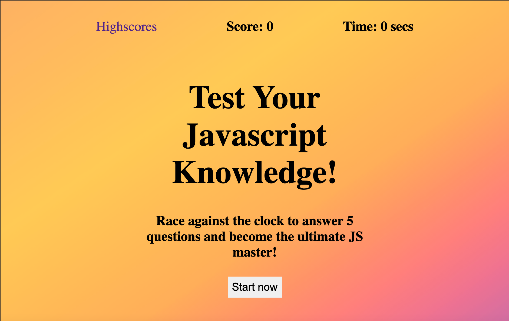
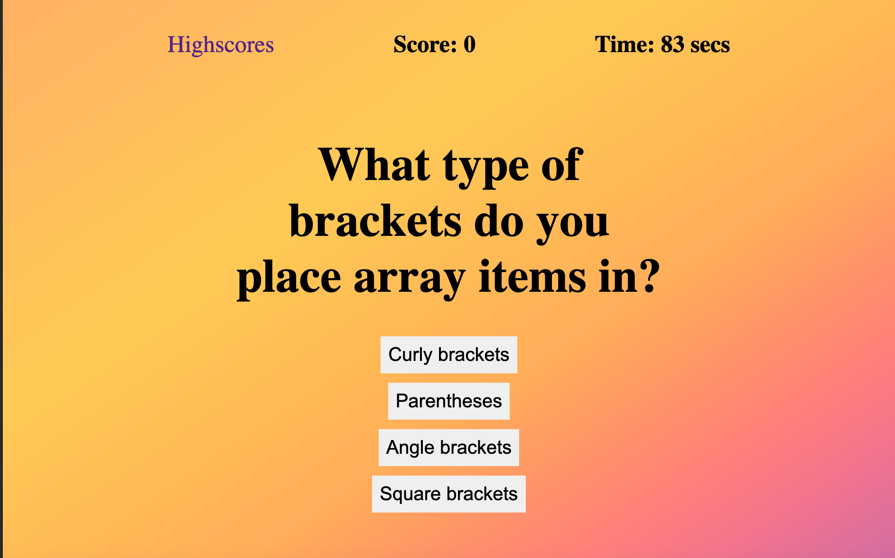
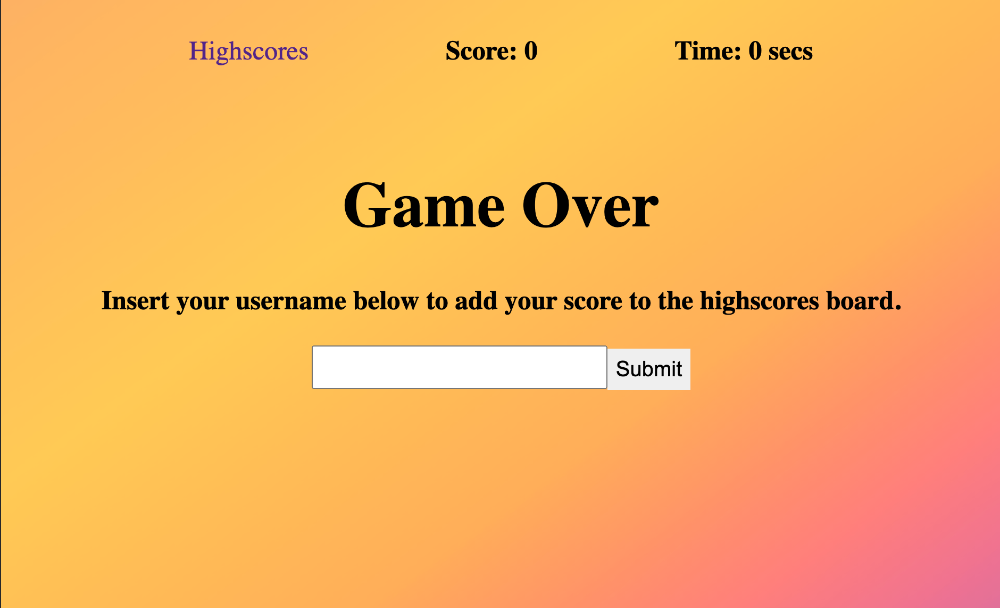
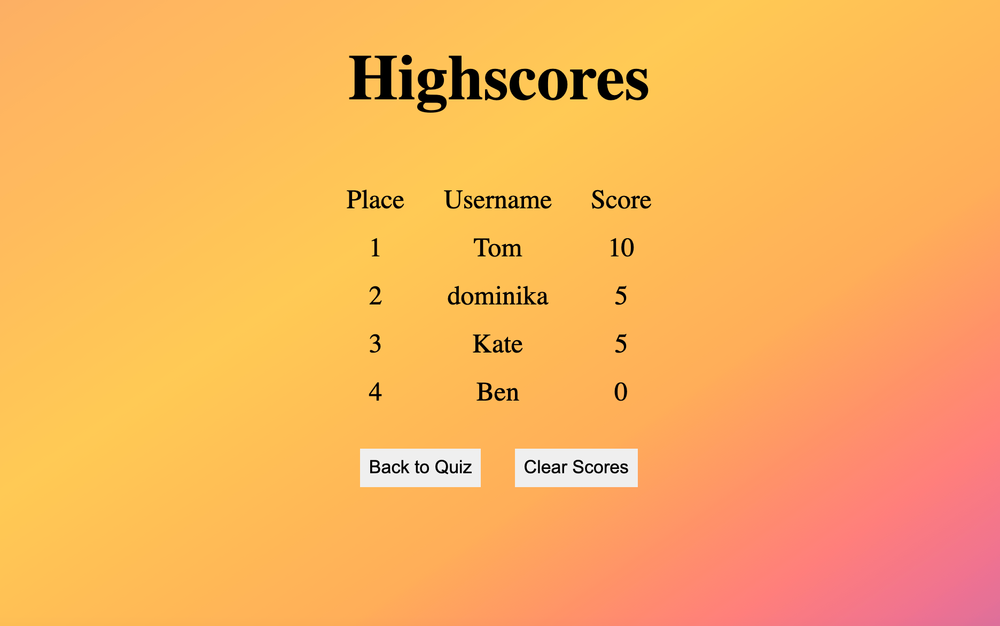

# Javascript Quiz

## Project Link

You can view this project on GitHub pages by clicking [here](https://dominikacookies.github.io/js-quiz/).

## License 
MIT License

## Description
This project is an interactive quiz which allows users to test their javascript knowledge and store scores to monitor progress over time.

### Key functionalities
- the quiz starts at the click of the 'Start now' button
- questions are presented one at a time, once a question is answered, the next one is presented
- every time the user selects the wrong answer, 5 seconds are deducted from the timer
- every time the user selects the correct answer, 5 points are added to their score
- the quiz finishes when the user has no more time left or has answered all questions
- at the end of the game, the user is able to save their username and score to a highscores page
- the user can access the highscores page at any time by clicking the 'Highscores' link in the header

## Technologies used
- HTML5
- CSS
- Javascript
- jQuery
- Local storage
- ES6 Functions

## Screenshots of App
### Start Screen
 

### Question Page

### Score Submission

### Highscores Page

## Video of App
You can view the app in action [here](.assets/../assets/screenshots/applicationworkingvideo.mov).
